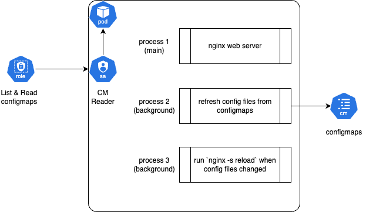

Auto-reload Nginx configuration file(s)
----------------------------------------

### Story Background

We've built an Nginx-based (OpenResty actually) API gateway in our system, in which we use super lightweight Lua scripts for RBAC, HTTP request transformation and client request throttling. The API gateway is deployed as a stateless deployment in Kubernetes, the configuration files are deployed along with the deployment as configmaps and secrets.

The API endpoints are managed with Nginx `location` directives like

```Nginx
location ~* /path/to/api/v1 {
  rewrite_by_lua_file /path/to/http_request_transformation.lua;
  access_by_lua_file /path/to/rbac.lua;
  content_by_lua_file /path/to/client_request_throttling.lua;
}
```

With continuous delivery approaches, the API endpoints change more often and could be deployed to the production anytime. It's super important to resync the Nginx configuration whenever the API endpoints changed, which is

```pseudocode
when endpoints changed:
  1. Create or update the configmaps
  2. Update Nginx configuration files
  3. Reload Nginx configuration by `nginx -s reload`
```

### Pain Point

The initial workaround was

1. Use continuous delivery pipeline to deploy / update the configmaps, which makes more sense cause the API definition is provided by individual service.

1. Restart the gateway deployment by `kubectl rollout restart deployment` to refresh the configuration files and force Nginx reload configurations.

It worked but there would be performance degrades because of deployment restarting, some 502 Bad Gateway errors were also addressed during the restarting, even failed to restart the Kubernetes deployment for various reasons which added more complexity to the pipelines.

We wanted something easy to implement, easy to maintain, easy to keep and most importantly more stable and reliable way to reload Nginx configurations.

### Solution

The solution is super simple and could be done within less than 100 lines of codes, and the gateway stability and system reliability is noticable improved.



1. The Nginx web server sill remains the main process, see [Dockerfile](../codebook/nginx-config-auto-reload/image/Dockerfile) and [entrypoint](../codebook/nginx-config-auto-reload/image/scripts/entrypoint.sh).

2. A background process is added to pull the configurations from Kubernetes configmap objects by HTTP request, compare the difference by tool `diff` and write to the `/etc/nginx/conf.d` folder when changes detected, see [refresh_config.sh](../codebook/nginx-config-auto-reload/image/scripts/refresh_config.sh).

3. Another backgroup process is added to monitor the files under `/etc/nginx/conf.d` folder with tool `inotifywait` and run `nginx -t` and `nginx -s reload` to reload configuration safely, see [reload_config.sh](../codebook/nginx-config-auto-reload/image/scripts/reload_config.sh).

### Try It!

Make sure you have proper access to a Kubernetes cluster, then

1. Deploy example pod

    ```bash
    kubectl apply -f https://raw.githubusercontent.com/actini/sre-diary/refs/heads/main/codebook/nginx-config-auto-reload/example-pod.yaml
    ```
1. Update the configmap

    ```bash
    kubectl edit configmap nginx-conf
    ```

1. Check the nginx logs and search for "Nginx configuration reloaded"

    ```bash
    kubectl logs -l "source=actini/sre-diary" -l "notebook=nginx-config-auto-reload" | grep -i "Nginx configuration reloaded"
    ```
1. Clean up resources

    ```bash
    kubectl delete -f https://raw.githubusercontent.com/actini/sre-diary/refs/heads/main/codebook/nginx-config-auto-reload/example-pod.yaml
    ```
